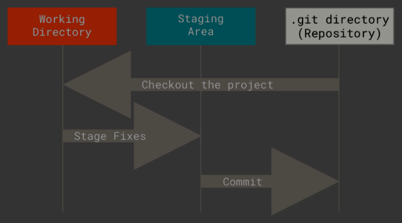

# Version Control

## Introduction

_Version control systems_ are essential tools of the software engineering world.

## Inventing version control

### Version control terminology 

- **Repository**: a local or remote store of the versions in our project
- **Working copy**: a local, editable copy of our project that we can work on
- **File**: a single file in our project 
- **Version** or **revision**: a record of the contents of our project at a point in time
- **Change** or **diff**: the difference between two versions 
- **Head**: the current version

## Features of a version control system

- **Reliable**: keep versions around for as long as we need them; allow backups
- **Multiple files**: track version of a project, not single files
- **Meaningful version**: what were the changes, why were they made?
- **Revert**: restore old versions, in whole or in part
- **Compare versions**: to see what changed
- **Review history**: for the whole project of individual files
- **Not just for code**: prose, images..

it should **allow multiple people to work together**:
- **Merge**: combine versions that diverged from a common previous version
- **Track responsibility**: who made that change, who touched that line of code?
- **Work in parallel**: allow one programmer to work on their own for a while (without giving up version control)
- **Work-in-progress**: allow multiple programmers to share unfinished work (without disrupting others, without giving up version control)

## Git 

- [Pro Git](http://git-scm.com/book) documents everything you might needd to know about Git.
- The [Git command reference](http://git-scm.com/docs) can help with the syntax of Git commands.

### The Git object graph

Git has three main states that your files can reside in: modified, staged, and committed:
- _Modified_ means that you have changed the file but have not committed it to your database yes.
- _Staged_ means that you have marked a modified file in its current version to go into your next commit snapshot.
- _Committed_ means that the data is safely stored in your local database.



## Git Cheatsheet
```bash
# git core editor 
git config --global core.editor vim

# git config list 
git config --list

# git lol 
git config --global alias.log "log --graph --oneline --decorate --color --all"
git log --name-status
git log --stat

# show the history of file including diffs
git log -p filename

git status
git pull 
git push origin main

git show 1255f4e
git show 1255f4e:
git show 1255f4e:hello.txt
```